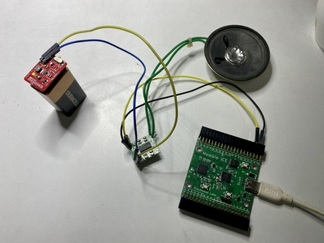

# Music Box 

A simple musical tune player. Code is from **fpga4fun** with some minor changes - 
mainly using a PLL to create a 25 MHz clock - to make it work for Humble iCE.

https://www.fpga4fun.com/MusicBox4.html

The audio output is on IOB_29B on J2, and in my case I have connected it to a 
PAM8403 based audio amplifier breakout and an 8 Ohm speaker.
