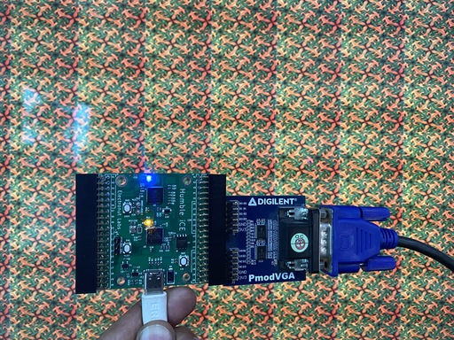

## VGA BRAM 



This example displays a scrolling 64 x 64 image using VGA. A Python script is provided 
which resizes the input image and creates a hex file which can be used to 
initialize the block RAM. (We use 12-bit RGB color.)

## PLL

We use *icepll* to generate *pll.v* for the 25 MHz clock signal needed for VGA.


## Inferring BRAM 

For sythesis to automatically infer BRAM, we need to access the memory in a 
careful way. This is discussed in detail in the article below:

https://zipcpu.com/tutorial/lsn-08-memory.pdf

If you infer BRAM correctly, you will see **ICESTORM_RAM** used in the next-pnr output. There are a total of 30 x 4Kb block RAM units on the iCE40UP5k.

```
Info: Device utilisation:
Info:            ICESTORM_LC:   220/ 5280     4%
Info:           ICESTORM_RAM:    12/   30    40%
Info:                  SB_IO:    16/   96    16%
Info:                  SB_GB:     1/    8    12%
Info:           ICESTORM_PLL:     1/    1   100%
Info:            SB_WARMBOOT:     0/    1     0%
Info:           ICESTORM_DSP:     0/    8     0%
Info:         ICESTORM_HFOSC:     0/    1     0%
Info:         ICESTORM_LFOSC:     0/    1     0%
Info:                 SB_I2C:     0/    2     0%
Info:                 SB_SPI:     0/    2     0%
Info:                 IO_I3C:     0/    2     0%
Info:            SB_LEDDA_IP:     0/    1     0%
Info:            SB_RGBA_DRV:     0/    1     0%
Info:         ICESTORM_SPRAM:     0/    4     0%
```

## VGA PMOD

This example uses the [Digilent VGA PMOD][1]. Connect it as shown in the photo above. 

[1]: https://digilent.com/shop/pmod-vga-video-graphics-array/
